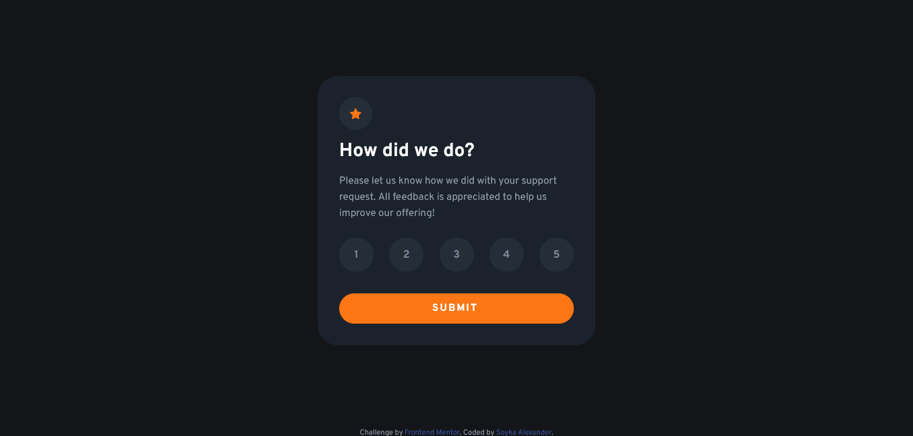

# Frontend Mentor - Interactive rating component solution

This is a solution to the [Interactive rating component challenge on Frontend Mentor](https://www.frontendmentor.io/challenges/interactive-rating-component-koxpeBUmI). Frontend Mentor challenges help you improve your coding skills by building realistic projects. 

## Table of contents

- [Overview](#overview)
  - [The challenge](#the-challenge)
  - [Screenshot](#screenshot)
  - [Links](#links)
- [My process](#my-process)
  - [Built with](#built-with)
  - [What I learned](#what-i-learned)
  - [Continued development](#continued-development)
  - [Useful resources](#useful-resources)
- [Author](#author)
- [Acknowledgments](#acknowledgments)

**Note: Delete this note and update the table of contents based on what sections you keep.**

## Overview

### The challenge

Users should be able to:

- View the optimal layout for the app depending on their device's screen size
- See hover states for all interactive elements on the page
- Select and submit a number rating
- See the "Thank you" card state after submitting a rating

### Screenshot

### Links

- Solution URL: [Add solution URL here](https://github.com/ASoyka/rating_card_FEM)
- Live Site URL: [Add live site URL here](https://asoyka.github.io/rating_card_FEM/)

## My process

### Built with

- Semantic HTML5 markup
- CSS custom properties
- Flexbox
- Javascript

### What I learned

Its my first time of using javascript, i learn how to add and remove classes. I use 'mouseenter' and 'mouseleave' in js instead ':hover' in css. I guess that my script.js is ugly for pro devs, but I'm proud of it, because it's my first script.js.

### Continued development

Maybe i can add 'back to rating' button on 'thank you' side of card, and alert message if you try submit without rating.

### Useful resources

- [Stackoverflow](https://ru.stackoverflow.com/) - This helped me with js when i get stuck.
- [Современный учебник JavaScript](https://learn.javascript.ru/) - This helped me with documentation to javascript.

## Author

- Website - [Soyka Alexander](https://asoyka.github.io/Portfolio_FCC/)
- Frontend Mentor - [@ASoyka](https://www.frontendmentor.io/profile/MrSoyka)
- GitHub - [@ASoyka](https://github.com/ASoyka)

## Acknowledgments

- Thanks to https://www.frontendmentor.io/.
